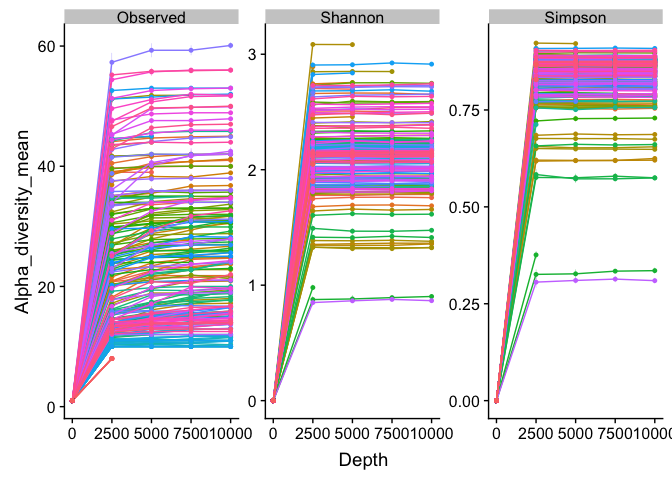

MC\_paper2\_phyloseq\_import
================
Zeya Zhengyao Xue
January 14, 2019

This file follows the analysis in QIIME2, which imports mapping file, feature table, taxonomy and tree as a 4-component phyloseq object.

Setting up packages and working directory
-----------------------------------------

``` r
library(phyloseq);packageVersion("phyloseq")
```

    ## [1] '1.22.3'

``` r
library(vegan);packageVersion("vegan")
```

    ## Warning: package 'vegan' was built under R version 3.4.4

    ## Loading required package: permute

    ## Loading required package: lattice

    ## This is vegan 2.5-1

    ## [1] '2.5.1'

``` r
library(ggplot2);packageVersion("ggplot2")
```

    ## Warning: package 'ggplot2' was built under R version 3.4.4

    ## [1] '3.1.0'

``` r
library(ggpubr); packageVersion("ggpubr") #  ggplot2 based publication ready fig
```

    ## Warning: package 'ggpubr' was built under R version 3.4.4

    ## Loading required package: magrittr

    ## [1] '0.2'

``` r
library(reshape2);packageVersion("reshape2")
```

    ## Warning: package 'reshape2' was built under R version 3.4.3

    ## [1] '1.4.3'

``` r
library(cowplot);packageVersion("cowplot")
```

    ## Warning: package 'cowplot' was built under R version 3.4.3

    ## 
    ## Attaching package: 'cowplot'

    ## The following object is masked from 'package:ggpubr':
    ## 
    ##     get_legend

    ## The following object is masked from 'package:ggplot2':
    ## 
    ##     ggsave

    ## [1] '0.9.2'

``` r
library(plyr)
```

    ## 
    ## Attaching package: 'plyr'

    ## The following object is masked from 'package:ggpubr':
    ## 
    ##     mutate

``` r
library(dplyr)
```

    ## Warning: package 'dplyr' was built under R version 3.4.4

    ## 
    ## Attaching package: 'dplyr'

    ## The following objects are masked from 'package:plyr':
    ## 
    ##     arrange, count, desc, failwith, id, mutate, rename, summarise,
    ##     summarize

    ## The following objects are masked from 'package:stats':
    ## 
    ##     filter, lag

    ## The following objects are masked from 'package:base':
    ## 
    ##     intersect, setdiff, setequal, union

``` r
path <- "~/Google Drive File Stream/My Drive/UC_Davis/Marco_lab/milk_microbiota/Mock_community/MC_paper2_QIIME2/"
```

Import QIIME2 output and make phyloseq object
---------------------------------------------

2/5/19: add Phase 3 results and import as the same ps object

``` r
# Transpose the QIIME2 output in excel
# For the theoretical values, I can adjust its absolute reads to suit data set by
# changing values in the feature table
SeqTab <- read.table(file.path(path, "feature_table/5file-combined_table-dada2-mc2.txt"), header = TRUE, stringsAsFactors = FALSE)
colnames(SeqTab) <- gsub("X","",colnames(SeqTab))
row.names(SeqTab) <- SeqTab$OTUID
SeqTab <- SeqTab[,-1]
SeqTab <- as.matrix.data.frame(SeqTab)

# Read in metadata file
samdf <- read.csv(file.path(path,"mapping/5file-MC_paper2_samdf.csv"))
rownames(samdf) <- samdf$SampleID

# Read in exported rooted tree 
tree <- read_tree(file.path(path,"5file-tree.nwk"))

# Parse out taxonomic assignment in excel and remove confidence column
# keep only taxa included in the "feature-table-mc2.csv" file
# Species column removed
TaxTab <- read.table(file.path(path,"5file-taxonomy-mc2.tsv"), header = TRUE, sep = '\t', na.strings = NA)
rownames(TaxTab) <- TaxTab$FeatureID
TaxTab <- TaxTab[,-1]
TaxTab <- as.matrix.data.frame(TaxTab)

# merge as the phyloseq ready to use
ps <- phyloseq(otu_table(SeqTab, taxa_are_rows = TRUE), tax_table(TaxTab),sample_data(samdf), phy_tree(tree))
ps # 1052 taxa and 212 samples 
```

    ## phyloseq-class experiment-level object
    ## otu_table()   OTU Table:         [ 1052 taxa and 212 samples ]
    ## sample_data() Sample Data:       [ 212 samples by 14 sample variables ]
    ## tax_table()   Taxonomy Table:    [ 1052 taxa by 6 taxonomic ranks ]
    ## phy_tree()    Phylogenetic Tree: [ 1052 tips and 1050 internal nodes ]

``` r
# Filter out singleton
ps <- filter_taxa(ps, function (x) {sum(x > 0) > 1}, prune=TRUE)
ps # 1049 taxa and 212 samples
```

    ## phyloseq-class experiment-level object
    ## otu_table()   OTU Table:         [ 1049 taxa and 212 samples ]
    ## sample_data() Sample Data:       [ 212 samples by 14 sample variables ]
    ## tax_table()   Taxonomy Table:    [ 1049 taxa by 6 taxonomic ranks ]
    ## phy_tree()    Phylogenetic Tree: [ 1049 tips and 1047 internal nodes ]

``` r
write.csv(ps@otu_table, file.path(path,"feature_table/5file-feature-table-mc2.csv"))
```

Filter ASVs based on taxonomy and abundance
-------------------------------------------

``` r
# Show available ranks in the dataset
rank_names(ps)
```

    ## [1] "Kingdom" "Phylum"  "Class"   "Order"   "Family"  "Genus"

``` r
# Create table, number of features for each phylum
table(tax_table(ps)[, "Phylum"], exclude = NULL)
```

    ## 
    ##                        [Thermi]  Actinobacteria   Bacteroidetes 
    ##              36               7             115             193 
    ##     Chloroflexi   Crenarchaeota   Cyanobacteria   Euryarchaeota 
    ##               5               1              11               4 
    ##      Firmicutes    Fusobacteria  Proteobacteria    Spirochaetes 
    ##             434               3             214               8 
    ##   Synergistetes     Tenericutes Verrucomicrobia 
    ##               1              15               2

``` r
# remove asv that was not assigned at phylum level
ps.Phy <- subset_taxa(ps, !is.na(Phylum) & !Phylum %in% c(""))
ps.Phy # 1013 taxa and 212 samples
```

    ## phyloseq-class experiment-level object
    ## otu_table()   OTU Table:         [ 1013 taxa and 212 samples ]
    ## sample_data() Sample Data:       [ 212 samples by 14 sample variables ]
    ## tax_table()   Taxonomy Table:    [ 1013 taxa by 6 taxonomic ranks ]
    ## phy_tree()    Phylogenetic Tree: [ 1013 tips and 1011 internal nodes ]

``` r
# Explore abundance to decide filter threshold
## Compute prevalence of each feature, store as data.frame
prevdf <- apply(X = otu_table(ps.Phy),
                MARGIN = ifelse(taxa_are_rows(ps.Phy), yes = 1, no = 2),
                FUN = function(x)(sum(x>0)))
# Add taxonomy and total read counts to this data.frame
prevdf <- data.frame(Prevalence = prevdf,
                     TotalAbundance = taxa_sums(ps.Phy),
                     tax_table(ps.Phy))
# plot the abudance per phylum 
ggplot(prevdf, aes(TotalAbundance, Prevalence / nsamples(ps.Phy),color=Phylum)) +
  # Include a guess for parameter
  geom_hline(yintercept = 0.01,  linetype = 2) + geom_point(size = 2, alpha = 0.7) +
  scale_x_log10() +  xlab("Total Abundance") + ylab("Prevalence [Frac. Samples]") +
  facet_wrap(~Phylum) + theme(legend.position="none")
```


``` r
# Most bacteria are in the Actinobacteria, Bacteroidetes, Firmircutes and Proteobacteria
# But I don't actually have Bacteroidetes members...

# Remove very low abudance ASVs independent of sample prevalence
x = taxa_sums(ps.Phy)
keepTaxa = which((x / sum(x)) > 0.00005)
ps.Phy05 <- prune_taxa(names(keepTaxa), ps.Phy)
ps.Phy05 # 197 taxa and 212 samples
```

    ## phyloseq-class experiment-level object
    ## otu_table()   OTU Table:         [ 197 taxa and 212 samples ]
    ## sample_data() Sample Data:       [ 212 samples by 14 sample variables ]
    ## tax_table()   Taxonomy Table:    [ 197 taxa by 6 taxonomic ranks ]
    ## phy_tree()    Phylogenetic Tree: [ 197 tips and 196 internal nodes ]

Determine rarefaction level for Alpha and Beta analysis later on
----------------------------------------------------------------

``` r
set.seed(123)
# Read in function to calculate alpha diversity and rarefaction levels
calculate_rarefaction_curves <-dget(file.path("~/src/Marco_Lab/FUN_calculate_rarefaction.R"))

rarefaction_curve_data <- calculate_rarefaction_curves(ps.Phy05, c("Observed", "Shannon","Simpson"), 
                                                       rep(c(1, 2500, 5000, 7500, 10000), each = 10))
rarefaction_curve_data$SampleID <- gsub("X","",rarefaction_curve_data$SampleID)
# summarize alpha diversity
rarefaction_curve_data_summary <- ddply(rarefaction_curve_data, c('Depth', 'SampleID', 'measures'), 
                                        summarise, 
                                        Alpha_diversity_mean = mean(Alpha_diversity), 
                                        Alpha_diversity_sd = sd(Alpha_diversity))
# Add sample data
rarefaction_curve_data_summary_verbose <- merge(rarefaction_curve_data_summary, 
                                                data.frame(sample_data(ps.Phy)), 
                                                by.x = 'SampleID', by.y = 'row.names')
```

    ## Warning in merge.data.frame(rarefaction_curve_data_summary,
    ## data.frame(sample_data(ps.Phy)), : column name 'SampleID' is duplicated in
    ## the result

``` r
rarefaction_curve_data_summary_verbose <- rarefaction_curve_data_summary_verbose[, -1]

# plot out rarefaction curve
ggplot(rarefaction_curve_data_summary_verbose, aes(x = Depth, y = Alpha_diversity_mean, 
                                                   ymin = Alpha_diversity_mean - Alpha_diversity_sd, 
                                                   ymax = Alpha_diversity_mean + Alpha_diversity_sd,
                                                   color = SampleID, group = SampleID)) +
  scale_fill_brewer(palette = "Set2") + 
  geom_line()+
  geom_pointrange(size=0.1)+
  theme(legend.position="none") + #  remove legend
  facet_wrap(facets = ~ measures, scales = "free")
```



``` r
# export the library size to a csv file
write.csv(sample_sums(ps.Phy05), file.path(path, "mapping/library_size_ps.Phy05_5file.csv"))

# The diversity leveled out after 2500 seqs per sample, rarefy at 3990
# to keep the sample with the fewest reads that is no a NC (MC.50.2)
```

Divide the ps object for different dataset
------------------------------------------

### For taxonomy analysis based on "ps.REC.glom"

#### Taxonomy plot for individual values

``` r
TaxBar <- function(ps, var1, var2, lvl = NULL, lvl2 = NULL, w, h, path.out){
  ExpTaxa <- c("Bacillaceae","Bacillus","Corynebacterium","Clostridiaceae",
               "Clostridium","Enterococcus","Escherichia","Lactococcus",
               "Pseudomonas","Staphylococcus","Streptococcus") 
  
  ps <-  ps %>% transform_sample_counts(function(x) x/sum(x) )  
  TaxTab <- tax_table(ps) %>% as.data.frame()
  taxa_names(ps) <- TaxTab$REC 
  allTaxa <- taxa_names(ps)
  ps.other <- prune_taxa(allTaxa[!(allTaxa %in% ExpTaxa)], ps)
  taxa.other <- ps.other@tax_table[,7] %>% as.character() # 7 for REC level 
  
  # change the taxa that are not the expected taxa to "Other" 
  TaxTab2 <- psmelt(ps)
  # merge/average per Sample and CheeseOutcome
  TaxTab2_agg <- aggregate(Abundance ~ TaxTab2[[var1]] + TaxTab2[[var2]] + REC,
                           data = TaxTab2,
                           mean)
  colnames(TaxTab2_agg)[1] <- var1
  colnames(TaxTab2_agg)[2] <- var2
  TaxTab2_agg$REC <- as.character(TaxTab2_agg$REC)
  TaxTab2_agg[TaxTab2_agg$REC %in% taxa.other,]$REC <- "Other"
  
  # Set colors for plotting
  mycol = c("#a6cee3","#1f78b4","#b2df8a","#33a02c","#fb9a99","#e31a1c",
            "#fdbf6f","#ff7f00","#cab2d6","#6a3d9a","#ffff99","#b15928")
  
  # Set orders for taxonomy and sampleID
  TaxTab2_agg$REC = factor(TaxTab2_agg$REC, levels = c(ExpTaxa, "Other"))
  if (!is.null(lvl)) TaxTab2_agg[[var1]] <- factor(TaxTab2_agg[[var1]], levels = lvl)
  if (!is.null(lvl2)) TaxTab2_agg[[var2]] <- factor(TaxTab2_agg[[var2]], levels = lvl2)
  
  pdf(path.out, width = w, height = h)
  p <- ggplot(TaxTab2_agg, aes(x = get(var1), y = Abundance, fill = REC)) +
    facet_grid(. ~ get(var2), scales = "free_x") + 
    geom_bar(stat = "identity") + 
    scale_fill_manual(values = mycol)+
    theme_bw(base_size = 15)+
    guides(fill = guide_legend(reverse = FALSE, keywidth = 1, keyheight = 1)) +
    ylab("Relative proportion")
  
  # convert ggplot object to grob object
  gp <- ggplotGrob(p)
  # optional: take a look at the grob object's layout 
  # gtable::gtable_show_layout(gp)
  # get gtable columns corresponding to the facets 
  facet.columns <- gp$layout$l[grepl("panel", gp$layout$name)]
  # get the number of unique x-axis values per facet (1 & 3, in this case)
  x.var <- sapply(ggplot_build(p)$layout$panel_scales_x, 
                  function(l) length(l$range$range))
  # change the relative widths of the facet columns based on how many unique 
  # x-axis values are in each facet
  gp$widths[facet.columns] <- gp$widths[facet.columns] * x.var
  # plot result
  grid::grid.draw(gp)
  dev.off()
}

# Read in sample ID order 
lvl.ID <- read.csv(file.path(path, "mapping/phase3_sample_orders.csv"), header = FALSE) 
lvl.ID$V1 <- as.character(lvl.ID$V1)
TaxBar(psList[[7]], var1 = "SampleID", var2 = "Kit", lvl = lvl.ID$V1,
       path.out = file.path(path,"feature_table/ps7_SampleID_Kit.pdf"), w = 9, h = 5)
```

    ## quartz_off_screen 
    ##                 2

``` r
TaxBar(psList[[7]], var1 = "SampleID", var2 = "Lysis", lvl = lvl.ID$V1, 
       lvl2 = c("Expected", "Bead beat: 2min x 6.5m/s", "Vortex: 15min", 
                "Chemical: 1hr", "Bead beat: 10s x 4m/s",
                "Chemical + Bead beat: 1hr + 10s x 4m/s",
                "Vortex: 30s", "Chemical + Vortex: 1hr + 30s "),
       path.out = file.path(path,"feature_table/ps7_SampleID_Lysis.pdf"), w = 9, h = 5)
```

    ## quartz_off_screen 
    ##                 2

``` r
# Plot for sample storage conditions (ps5)
TaxBar(subset_samples(psList[[5]], For_AVE %in% c("Glycerol","PBS2","Expected2")),  
       # subset to include only BCMC2 samples 
       var1 = "SampleID", var2 = "For_AVE",
       lvl = c("Theo2.1","Theo2.2","Theo2.3",
               "MC.PBS.1","MC.PBS.2","MC.PBS.3",
               "MC.25.glycerol.1","MC.25.glycerol.2","MC.25.glycerol.3"), 
       lvl2 = c("Expected2","PBS2", "Glycerol"),
       path.out = file.path(path, "feature_table/ps5_SampleID_For_AVE.pdf"), 5, 5)
```

    ## quartz_off_screen 
    ##                 2

``` r
# Plot for milk volumne collection (ps6)
TaxBar(subset_samples(psList[[6]], SampleID != "Theo2.2" & SampleID != "Theo2.3" &  
                        # subset to contain only one expected value
                        SampleID != "10TB.1" & SampleID != "10TB.2" & SampleID != "10TB.3"),
                        # subset to include only one set of 10ml samples
       var1 = "SampleID", var2 = "For_AVE",
       lvl = c("Theo2.1","MC.30ml.UHT.1","MC.30ml.UHT.2","MC.30ml.UHT.3",
               "MC.10ml.UHT.1","MC.10ml.UHT.2","MC.10ml.UHT.3",
               "MC.1ml.UHT.1","MC.1ml.UHT.2","MC.1ml.UHT.3","200TB.1","200TB.2","200TB.3"),
       lvl2 = c("Expected","30ml","10ml","1ml","200uL"),
       path.out = file.path(path, "feature_table/ps6_SampleID_For_AVE.pdf"),7.5,5)
```

    ## quartz_off_screen 
    ##                 2

``` r
# Plot for PMA (ps4)
TaxBar(subset_samples(psList[[4]], SampleID != "Theo2.2" & SampleID != "Theo2.3"), 
       var1 = "SampleID", var2 = "For_AVE",
       lvl = c("Theo2.1", "MC.50.control.1","MC.live.control.1","MC.dead.control.1",
               "MC.live.1","Mc.live.2","MC.live.3","MC.50.1","MC.50.2","MC.50.3",
               "MC.dead.1","MC.dead.2","MC.dead.3"),
       lvl2 = c("Expected","Untreated","Live","Half","Dead"),
       path.out = file.path(path, "feature_table/ps4_SampleID_For_AVE.pdf"),7,5)
```

    ## quartz_off_screen 
    ##                 2

#### Taxonomy plot for average values

### For alpha and beta div based on ps.REC.glom after rarefaction (ps.REC.glom.rare)

I did not use ps.Phy05 for beta because the expected ASV is not the same as the actual sequenced ASV. If use ps.Phy05, the Bray distance of samples from expected would all be 1 (doesn't share any common species). The assumption is that the taxa assignment is accurate until Genus. Therefore, for alpha diversity, I would also use ps.REC.glom to keep until Genus level.

#### Alpha diversity

``` r
# Define function that plots out alpha box plot as well as p values
AlphaBox <- function(ps, alpha_measures, var1, var, lvl, path.out, w, h){
  df <- estimate_richness(ps, split = TRUE, measures = alpha_measures) 
  row.names(df) <- gsub("X","",row.names(df) )
  # add sample metadata information
  df <- merge(df, data.frame(sample_data(ps)), by.x = 'row.names', by.y = 'row.names')
  df <- df[, -1]
  # Melt dataframe for plotting figures
  dfm <- melt(df, id.vars = c("SampleID", var),
              variable.name = "measure", value.name = "value")
  dfm[[var1]] <- factor(dfm[[var1]], levels = lvl)
  
  pdf(path.out, w, h)
  p<- ggboxplot(dfm, x = var1, y = "value", add = "jitter", palette = "Set3",
                font.label = list(size = 18, face = "plain"), ggtheme = theme_bw())+
    stat_compare_means(method = "t.test", ref.group = "Expected", 
                       hide.ns = TRUE,  label = "p.signif")

  facet(p, facet.by = "measure", scales = "free") %>% print()
  dev.off()
}

# Alpha box plot on ps6 (sample volume)
AlphaBox(subset_samples(psList.rare[[6]], SampleID != "10TB.1" & SampleID != "10TB.2" & SampleID != "10TB.3"),
         # subset to include only one set of 10ml samples 
         alpha_measures = c("Observed", "Shannon"),
         var1 = "For_AVE", var = c("KIT","For_AVE","STORAGE","MATRIX","PMA",
                                   "SampleOrCtrl","LYSING","Chemical_time",
                                   "Bead_beat_speed_time","vortex_time","Description"),
         lvl = c("Expected","30ml","10ml","1ml","200uL"),
         path.out = file.path(path, "alpha/ps6_ForAVE.pdf"), 4.5, 2.3)
```

    ## Warning: Computation failed in `stat_compare_means()`:
    ## data are essentially constant

    ## quartz_off_screen 
    ##                 2

``` r
# Alpha box plot on ps 4 (PMA)
AlphaBox(psList.rare[[4]], alpha_measures = c("Observed", "Shannon"),
         var1 = "For_AVE", var = c("KIT","For_AVE","VOL","STORAGE","MATRIX","PMA",
                                   "SampleOrCtrl","LYSING","Chemical_time",
                                   "Bead_beat_speed_time","vortex_time","Description"),
         lvl = c("Expected","Untreated","Live","Half","Dead"),
         path.out = file.path(path, "alpha/ps4_ForAVE.pdf"), 4.5, 2.3)
```

    ## quartz_off_screen 
    ##                 2

qPCR results
------------

### PMA on single bacterial strain or gDNA

``` r
# PMA on E.coli gDNA 
PMA.conc <- read.csv(file.path(path, "qPCR/10min_conc.csv"))
gghistogram(PMA.conc, x = "Ct_diff",
            add = "mean", rug = TRUE, color = "Treatment", fill = "Treatment",
            palette = c("#00AFBB", "#E7B800"))
```

    ## Warning: Using `bins = 30` by default. Pick better value with the argument
    ## `bins`.


``` r
pdf(file.path(path, "qPCR/10min_conc.pdf"), 3.2, 3)
print(ggboxplot(PMA.conc, x = "Treatment", y = "Ct_diff",
                font.label = list(size = 18, face = "plain"), 
                ggtheme = theme_bw()) +
        stat_compare_means(method = "kruskal", hide.ns = TRUE, label = "p.signif"))
dev.off()
```

    ## quartz_off_screen 
    ##                 2

``` r
# PMA on 3 species strain 
PMA.T <- read.csv(file.path(path, "qPCR/50uM_time.csv"))
PMA.T$Cell_state <- factor(PMA.T$Cell_state, levels = c("Live", "Half", "Dead"))
## make a df to p value annotation
df.anno = compare_means(PerOf_untreated ~ Treatment, method = "kruskal.test",
                        group.by = "Species", data = PMA.T) %>% mutate(y_pos = 40)

pdf(file.path(path, "qPCR/50uM_time.pdf"), 6, 3)
print(ggboxplot(subset(PMA.T, PerOf_untreated != "NA"), 
                x = "Treatment", y = "PerOf_untreated", color = "Cell_state",
                font.label = list(size = 18, face = "plain"), 
                palette = "jco", ggtheme = theme_bw()) +
        facet_wrap(~Species, scales = "free_x"))
dev.off()
```

    ## quartz_off_screen 
    ##                 2

``` r
# PMA on MC 
PMC.mc <- read.csv(file.path(path,"qPCR/MC_total.csv"))
PMC.mc$Cell_state <- factor(PMC.mc$Cell_state, levels = c("Live", "Half", "Dead"))

pdf(file.path(path, "qPCR/PMC.mc.pdf"), 3.2, 3)
print(ggboxplot(subset(PMC.mc, PerOf_untreated != "NA"), 
                x = "Cell_state", y = "PerOf_untreated", color = "Cell_state",
                font.label = list(size = 18, face = "plain"), 
                palette = "jco", ggtheme = theme_bw()) +
        stat_compare_means(method = "kruskal.test", hide.ns = TRUE,  label = "p.signif"))
dev.off()
```

    ## quartz_off_screen 
    ##                 2

Use decontam package to see if by removing the UHT taxa, the vol (ps6) will be better
-------------------------------------------------------------------------------------

At the end, the decontam package did not remove much of the contaminant, unexpected taxa. Therefore, I decided to take a closer look by manually examine the taxtab. Also, I want to find out if, for example, the Bacillus in MC is the same ASV as in UHT. If not, I may be able to perform manual filtering.

Manual filtering to see if by removing the UHT taxa, the vol (ps6) will be better
---------------------------------------------------------------------------------

Percent recovery of GBS DNA with meconium extractions generated from various extraction kits. Data are mean ± S
